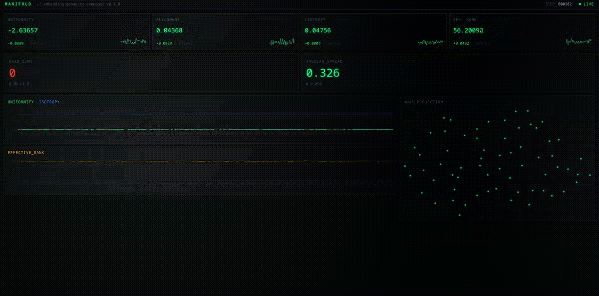

# manifold

> Real-time visual debugger for embedding spaces in contrastive learning.

[](https://www.python.org)
[](LICENSE)
[](https://github.com/nicolasallerponte/manifold/actions)



Stop finding out your embeddings collapsed after training.  
**manifold** shows you the geometry of your representation space in real time.

---
# NOT IMPLEMENTED YET
## one line to integrate
```python
from manifold import watch

encoder = MyEncoder()
hook = watch(encoder, log_every=100)  # that's it
```

Open `http://localhost:5173` and watch your embedding space live.

---

## what it tracks

| metric | what it means | good direction |
|---|---|---|
| **uniformity** | how evenly embeddings cover the hypersphere | lower |
| **alignment** | average distance between positive pairs | lower |
| **isotropy** | how many dimensions are actively used | higher |
| **effective rank** | intrinsic dimensionality of the embedding space | higher |
| **dead dimensions** | dimensions with near-zero variance | fewer |
| **angular spread** | distribution of pairwise cosine similarities | wider |

---

## why this exists

When training contrastive models (CLIP, SimCLR, DINOv2-style), two failure modes are silent:

- **dimensional collapse** — your 128-dim embedding space collapses to a 3-dim manifold
- **uniform collapse** — all embeddings converge to the same point

Both tank downstream performance. Neither shows up in your training loss.  
manifold makes them visible before you waste GPU hours.

---

## install
```bash
pip install manifold-debug
```

Or from source:
```bash
git clone https://github.com/nicolasallerponte/manifold
cd manifold
uv pip install -e ".[dev]"
```

Start the dashboard:
```bash
cd dashboard && npm install && npm run dev
```

---

## usage

### with any PyTorch module
```python
from manifold import watch

hook = watch(encoder, log_every=100)

# train as normal
for batch in dataloader:
    embeddings = encoder(batch)
    loss = criterion(embeddings)
    loss.backward()
    optimizer.step()

hook.remove()
```

### with PyTorch Lightning
```python
from manifold.integrations.lightning import ManifoldCallback

trainer = pl.Trainer(callbacks=[ManifoldCallback(log_every=100)])
```

### with HuggingFace Trainer
```python
from manifold.integrations.huggingface import ManifoldCallback

trainer = Trainer(callbacks=[ManifoldCallback(log_every=100)])
```

### context manager
```python
with watch(encoder, log_every=50) as hook:
    train(encoder)
# hook removed automatically
```

---

## metrics reference
```python
from manifold.core.metrics import compute_all
import torch

z = torch.randn(64, 128)  # your embeddings
metrics = compute_all(z)

# {
#   'uniformity': -2.61,
#   'isotropy': 0.04,
#   'effective_rank': 55.8,
#   'dead_dimensions': {'count': 0, 'ratio': 0.0, 'indices': []},
#   'angular_spread': {'mean': 0.33, 'std': 0.09, 'max': 0.91, 'min': -0.71}
# }
```

---

## architecture
```
manifold/
├── manifold/
│   ├── core/
│   │   ├── metrics.py      # uniformity, alignment, isotropy, rank, dead dims
│   │   └── hooks.py        # PyTorch forward hook + history
│   ├── integrations/
│   │   ├── lightning.py    # PyTorch Lightning callback
│   │   └── huggingface.py  # HuggingFace Trainer callback
│   └── server/
│       └── watcher.py      # FastAPI + WebSocket broadcast
└── dashboard/              # React + Vite + Tailwind
```

---

## roadmap

- [ ] PyPI release
- [ ] PyTorch Lightning callback
- [ ] HuggingFace Trainer callback
- [ ] Collapse detection alerts via email/Slack
- [ ] Export metrics to W&B / MLflow
- [ ] Multi-run comparison view

---

## background

Metrics based on:
- Wang & Isola (2020) — [Understanding Contrastive Representation Learning](https://arxiv.org/abs/2005.10242)
- Roy & Vetterli (2007) — effective rank
- Mu & Viswanath (2018) — isotropy in embedding spaces

---

## license

MIT
